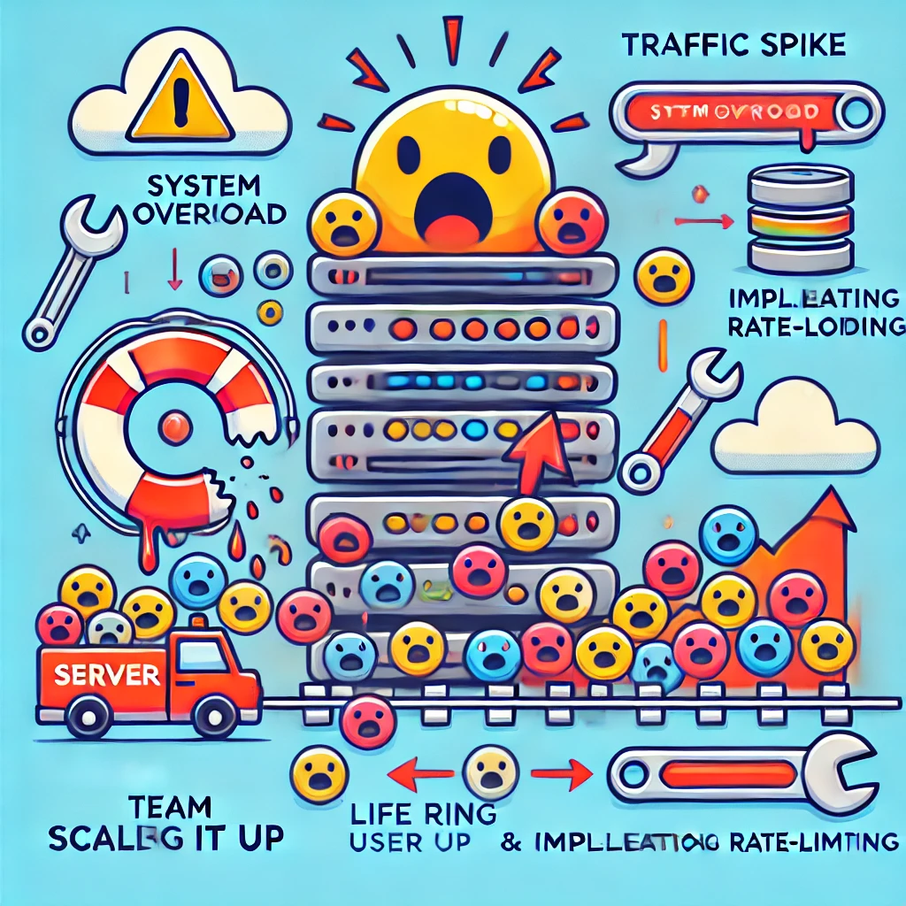

# Postmortem

Server Downtime Due to Traffic Spike

## Issue Summary

- **Duration**: 2 hours and 15 minutes, from 2024-09-25, 10:00 AM - 12:15 PM UTC+0.
- **Impact**: 85% of users faced slow or failed logins. The primary API server was drowning in traffic like a server-sized inflatable raft in a monsoon.
- **Root Cause**: The autoscaling was caught off-guard by the flood of requests. It needed a little extra caffeine to keep up!

## Timeline

- **10:05 AM**: Our alert system screamed "Server! Server! Server!"
- **10:07 AM**: Engineers jumped in, thinking, "Maybe the database choked on something?" Nope! The database was fine.
- **10:25 AM**: We saw the huge traffic surge and thought, "This isn’t a drill… or is it?"
- **10:40 AM**: Reverted to a previous code version—nope, still drowning.
- **11:00 AM**: DevOps team gets the emergency call: "Houston, we have a scaling problem!"
- **11:20 AM**: Manual scaling begins and rate-limiting is activated.
- **12:15 PM**: The server caught its breath. Back to normal!

## Root Cause and Resolution

- **Root Cause**: Our server autoscaling took a nap during a massive traffic spike. It wasn’t prepared for such a sharp increase in user requests, causing CPU and memory exhaustion.
- **Resolution**: We manually added server instances, gave autoscaling a wake-up call (reconfiguration), and applied rate-limiting to avoid further meltdowns.

## Corrective and Preventative Measures

- **Improvements/Fixes**:

  1. Supercharge autoscaling so it's ready for any surprise party.
  2. Install new monitoring sensors to catch traffic spikes like a pro.
  3. Rate-limit high-traffic zones to keep things cool under pressure.
  4. Run a load test (like a mini traffic apocalypse) to make sure we're future-proof.

- **TODOs**:
  1. Tweak autoscaling rules to respond faster.
  2. Upgrade monitoring to spot unexpected traffic.
  3. Implement throttling to prevent overload.
  4. Document this postmortem under: "When Traffic Gets Wild."

Here’s a little visual of our server’s journey from overload to smooth sailing!

